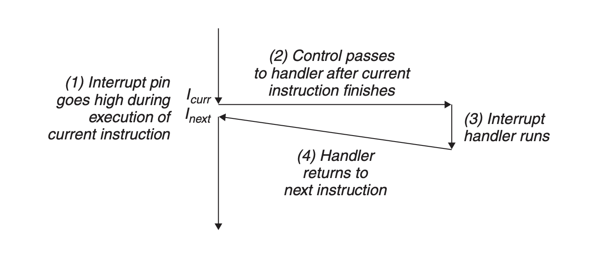

<!--toc:start-->

- [Exceptional Control Flow](#exceptional-control-flow)
- [Exceptions](#exceptions)
  - [Exception Handling](#exception-handling)
  - [Interrupts](#interrupts)
  - [Traps and System Calls](#traps-and-system-calls)
  - [Faults](#faults)
  - [Aborts](#aborts)
  - [Exception in Linux](#exception-in-linux)
- [Processes](#processes)
  - [Logical Control Flow](#logical-control-flow)
  - [Concurrent Flows](#concurrent-flows)
  - [Context switching](#context-switching)
  - [System Call Error Handling](#system-call-error-handling)
  - [Process Control](#process-control)
- [Signals](#signals)
  - [Process Groups](#process-groups)
  - [Sending Signal with the kill Function](#sending-signal-with-the-kill-function)
  - [Signal handling](#signal-handling)
  - [Handling Signals using sigaction](#handling-signals-using-sigaction)
- [Summary](#summary)
<!--toc:end-->

### Exceptional Control Flow

From the time you first apply power to a processor until the time you shut it off,
the program counter assumes a sequence of values, where each value is the address of some
corresponding instruction.

Each _transition_ is called the `flow of control` or `control flow`.

Systems must also be ablt to react to changes in system stat that are not captured by internal program variables
and are not related to the execution of the program.

Modern systems react to these situations by making abrupt changes in the control flow.

We refer to these abrup changes as **exceptional control flow (ECF)**
Exceptional control flow occurs at all levels of a computer system.
For example

- At the hardware level, events detected by the hardware trigger abrupt control transfers to
  exception handlers.
- At the operating systems level, the kernel transfers control from one user process to another
  via context switches.
- At the application level, a process can send a signal to another process that abruptly transfers
  control to a signal handler in the recipient

## Exceptions

An _exception_ is an **abrupt** change is the ocntrol flow in response to some change int the processor's
state.

The processor is executing some current instructions, when a significant change in the processor's state
occurs, The state is encoded in various bits and signals inside the processor.

The change in state is known as an _event_.

The event might be directly related to the execution of the current instruction.

For example

- A virtual memory page fault occurs
- An arithmetic overflow occurs
- An instruction attempts a divide by zero.

On the other hand, the event might be unrelated to the execution of the current instruction.
For example

- A system timer goes off
- An I/O request completes.

When the processor detects that the event has occurred, it makes and indirect procefure call the **exception**
, through a jump table called and _exception table_ to an operating system subroutine the **exception handler**
that is designed to process this particular kind of event.

When the exception handler is finished processing, one of three thing happens.

1. The handler returns control to the current instruction Icurr, the instruction that was executing when the event occurred.
2. The handler returns control to next instruction,the instruction that would have executed next had the exception not occurred.
3. The handler aborts the interrupted program.

Anatomy of an exception.
A change in the processor’s state _event_ triggers an abrupt control transfer
_an exception_ from the application program to an exception handler.
After it finishes processing, the handler either returns control to the interrupted program or aborts.


### Exception Handling


The Exception Table has a number of entries each entry is represented with a uniq, nonnegative integer
called _exception number_ and each entry contains the address of the handler code for the exception _k_.

Some number are assigned by the designer of the processor, other number are assigned by the designers of the
operating system such: division by zero, page faults, memory access violations, break points, and arithmetic overflows, system calls and signals.

At system boot time **when the computer is reset or powered on**,
the operating system allocates and initializes a jump table called an **exception table**

At the run time, when the system is executing some program, the processor detects that an event has occurred
it determines the corresponding exception number in the exception table.

The processor then triggers the exception calling the entry of the handler.

The exception number is an index into the exception table, whose starting address is contained in a special _CPU_ register
called the _exception table base register._


Once the hardware triggers the exception, the rest of the work is done in software by the exception handler.

After the handler has processed the event, it optionally returns to the interrupted program by executing a special
“return from interrupt” instruction, which pops the appropriate state back into the processor’s control and data registers,
restores the state to user mode

Exceptions can be divided into four classes

- interrupts
- traps
- faults
- aborts

| Class     | Cause                         | Async/Sync | Return behavior                     |
| --------- | ----------------------------- | ---------- | ----------------------------------- |
| Interrupt | Signal from I/O device        | Async      | Always returns to next instruction  |
| Trap      | Intentional exception         | Sync       | Always returns to next instruction  |
| Fault     | Potentially recoverable error | Sync       | Might return to current instruction |
| Abort     | Nonrecoverable error          | Sync       | Never returns                       |

### Interrupts

Interrupts accur _asunchronously_ as a result of signals from I/O devices that are external to the processor.

They are asynchronous since they are not caused by the execution of any particular instruction.

Exception handlers for hardware intrerrupts are often called **interrupt handlers**



After the current instruction finishes executing, the processor notices that the interrupt pin has gone high, reads the exception number from the system bus,
and then calls the appropriate interrupt handler.

When the handler returns, it returns control to the next instruction (i.e., the instruction that would have followed the current instruction in the control flow had the interrupt not occurred).

The effect is that the program continues executing as though the interrupt had never happened.
The remaining classes of exceptions `traps, faults, and aborts` occur synchronously as a result of executing the current instruction.
We refer to this instruction as the **faulting instruction**.

### Traps and System Calls

Traps are intentional exceptions generated by user programs when they want to interact with the kernel, in our case syscalls.

Traps are intentional exceptions that occur as a result of executing an instruction.
Like interrupt handlers, trap handlers return control to the next instruction.
The most important use of traps is to provide a procedure-like interface between user programs and the kernel known as a system call.

User programs often need to request services from the kernel such as reading a file (read), creating a new process (fork), loading a new program (execve), or terminating the current process (exit).
To allow controlled access to such kernel services, processors provide a special “syscall n” instruction that user programs can execute when they want to request service n.
Executing the syscall instruction causes a trap to an exception handler that decodes the argument and calls the appropriate kernel routine.
From a programmer’s perspective, a system call is identical to a


From the programmer perspective a system call is identical to a regular function.

However, their implementations are quite different, Regular function run in the _user mode_,
which restricts the types of instructions they can execute, and they access the same stack as the calling function.

A system call runs in the _kernel mode_, which allows it to execute instructions and accesses a stack defined
in the kernel.

### Faults

Faults result from error conditions that a handler might be able to correct.

When a fault occurs, the processor transfers control to the fault handler, if the handler is able to
correct the error condition, it returns control to the faulting instruction, otherwise the handler
returns to an `abort` routine in the kernel that terminates the application program that caused the fault


### Aborts

Aborts result from unrecoverable fatal errors, typically hardware errors such as parity errors that occur when DRAM
or SRAM bits are corrupted.
Abort handlers never return control to the application program.


Abort handling. The abort handler passes control to a kernel abort routine that terminates the application program.

### Exception in Linux

Each system call has a unique integer number that corresponds to an offset in a jum table in the kernel.

system calls are represented as an int, starting from the address 0x80.

## Processes

The Classic definition of a process is an instance of a program in execution phase

Each program in the system runs in the context of some process.
The context consists of the state that the program needs to run correctly.
This state includes the **program’s code and data stored in memory, its stack, the contents of its general purpose registers, its program counter, environment variables, and the set of open file descriptors**.

### Logical Control Flow

A process provides each program with the illusion that it has exclusive use of the processor,
even though many other programs are typically running concurrently on the system.

Considering a system that runs three processes, The **single physical control** flow of the processor is partitioned
into three logical flows, one for each process, Each vertical line represents a portion of the logical flow for a process


Processes in the figure take turns using the processor.

Easch process executes a portion of it's flow and then is _preempted temporarily suspended_ while other processes take their
turns.

each process endes it resums back completing the previous process state.

### Concurrent Flows

Logical flows take many different forms in computer systems, Exception handlers, processes, signal handlers, threads, ...

A logical flow whose execution overlaps in time with another flow is called a **concurrent flow**
and the two flows are said to _run concurrently_

For example, in the above figure processes `A` and `B` run concurrently, as do `A` and `C`.
On the other hand, `B` and `C` do not run concurrently, because the last instruction of `B` executes
before the first instruction of `C`

So we say `A` and `B` are concurrent but, `B` and `C` are not.

The general phenomenon of multiple flows executing concurrently is known as **concurrency**.

The notion of a process taking turns with other processes is also known as **multitasking**

Processors typically provide this capability with a mode bit in some control
register that characterizes the privileges that the process currently enjoys.

When the mode bit is set, the process is running in kernel mode (sometimes called supervisor mode).
A process running in kernel mode can execute any instruction in the instruction set and access any memory location in the system.

When the mode bit is not set, the process is running in the _user mode_.
A process that is running in user mode not allowed to execute _privileged instructions_, such I/O operations or changing
the mode bit, Nor it's allowed to directly reference code or data in the kernel area of the address space.

Any access would lead to a fatal protection fault.

Users programs must instead access kernel code and data indirectly **via the system call interface**.


### Context switching

Cpu switching from one process to another, that is called Context switching, which saves the state of the old
process and load saved state for the other process

On The context switching The process is stored in **the process control block (PCB)**
so that all process can be resumed from the same part it was left

each process state is saved in registers **name of register**

The operating system kernel implements multitasking using a higher level
form of exceptional control flow known as a context switch.

The context switch mechanism is built on top of the lower-level exception mechanism.

The kernel maintains a context for each process.
The context is the state that the kernel needs to restart a preempted process.
It consists of the values of objects such as

- The general purpose registers
- The floating-point registers
- The program counter
- User’s stack
- Status registers
- Kernel’s stack

and various kernel data structures such as

- A page table that characterizes the address space
- A process table that contains information about the current process
- A file table that contains information about the files that the process has opened.

During the execution of a process, the kernel can decide to preempt the current process and restart the previous preempted process.

This is called as `Scheduling` and it's handled by code in the kernel called the `scheduler`.

After the kernel chose which process to run, it preempts the current process and transfer control to the new process
using a mechanism called a **context switching** that

1. saves the context of the current process.
2. restores the saved context of some previously preempted process.
3. passes control to this newly restored process.

A context switch can occur while the kernel is executing a sys call, for example reading from a disk
The system call `read` requires a disk access, the kernel in this case opt to perform a context switch and run
another process instead of waiting fro the date to arrive from the disk.


The kernel is executing instructions in user mode on behalf of process `A`.
During the first part of the switch, the kernel is executing instructions in kernel mode on behalf of process `A`.
Then at some point it begins executing instructions (still in kernel mode) on behalf of process `B`.

And after the switch, the kernel is executing instructions in user mode on behalf of process `B`.
Process `B` then runs for a while in user mode until the disk sends an interrupt to signal that data has been transferred from disk to memory. The kernel decides that process B has run long enough and performs a context switch from process `B` to `A`
returning control in process `A` to the instruction immediately following the read system call.
Process `A` continues to run until the next exception occurs, and so on.

### System Call Error Handling

This is how we might check for errors when we call the Linux `fork` function

```c
if ((pid = fork()) < 0 )
{
    fprintf(stderr, "fork error: %\n", strerror(errno))
    exit(0);
}
```

The `strerror` function returns a text string that describes the error associated with a particular
value of `errono`.

a great way to handle errors with syscalls in ourcase `fork` syscall

```c
pid_t Fork(void)
{
    pid_t pid;

    if ((pid = fork()) < 0)
        unix_error("Fork error");
    return pid;
}
```

So the function would be used like this

```c
pid = Fork()
```

### Process Control

Unix provides a number of system calls for manipulating processes from C programs.
This section describes the important functions and gives examples of how they are used.

Each process has a unique nonzero process ID, The `getpid` function returns
the process ID of the current process, The `getppid` function returns the parent process id

```c
#include <sys/types.h>
#include <unistd.h>

pid_t getpid(void);
pid_t getppid(void);
```

We can thing of a process as being in one of three states

- Running The process is either executing on the CPU or waiting to be executed and will be scheduled
  by the kernel.
- Stopped the execution of the process.
- Terminated, the process is stopped permanently, a process is terminated for one of three reasons.

  1. receiving a signal whose default action is to reminated the process.
  2. returning from the main routine.
  3. calling the exit system function call.

  The fork function is interesting (and often confusing) because it is called once but it returns twice.

  - once in the calling process (the parent)
  - and once in the newly created child process.

## Signals

A Signal is a small message that notifies a process that an event of some type has occurred in the system.

Each signal type corresponds to some kind of system event.

If a process attempts to divide by zero the kernel sends it a `SIGFPE` signal.
If a process makes an illegal memory reference, the kernel sends it a `SIGSEGV` signal.

The Kernel sends or _delivers_ a signal to a destination process by **updating some state in the context of the destination process**

The Signal is delivered for one of two reasons.

1. The Kernel has detected a system event sush as _zero divition error_ or termination of a child process.
2. A process has invoked the `kill` function to explicitly request the kernel to send a signal to the destination process,
   A process can send a signal to itself.

A Signal That has sent but not received is called a _pending signal_, pending signals are not queued, they're **discarded**.


Signal handling: Recept of a signal triggers a control transger to a signal handlel. After it finishes processing, the handler returns control
to the handler returns control to the interrupted program.

### Process Groups

Every process belongs to exactly one _process group_, which is identified by a positive integer _process group id_

The `getpgrp` function returns the process group ID of the current process.

```c
#include <unistd.h>

pid_t getpgrp(void);
```

By default, a child process belogns to the same process group as its parent, A process can change the process group of itself or another process
by using the `setpgid` function

```c
#include <unistd.h>

// pid: process id
// pgid: process group id
int setpgid(pid_t pid, pid_t pgid);
```

### Sending Signal with the kill Function

Process send signals to other processes _including themselves_ by calling the
`kill` function

```c
#include <sys/types.h>
#include <signal.h>

int kill(pid_t pid, int sig);
```

If `pid` is greater than zero, then the kill function sends signal number `sig` to process `pid`.

If pid is less than zero, then `kill` sends signal `sig` to every process in process group.

An example of Using the `kill` function to send a signal to a child.

```c
#include <stdio.h>

int main(void)
{
    pid_t pid;

    /* Chil sleeps until SIGKILL signal received, then dies */
    if ((pid = Fork()) == 0)
    {
        Pause(); /* Wait for a signal to arrive */
        printf("control should never reasch here!\n");
        exit(0);
    }

    /* Parent sends a SIGKILL signal to a child */
    KIll(pid, SIGKILL);
    exit(0);
}
```

Each signal type has a predefined _default action_, which is one the following:

- The process terminates
- The process terminates and dumps core
- The process stops until restared by a `SIGCONT` signal.
- The process ignores the signal.

For example `SIGKILL` is to terminate the receiving process, `SIGCHILD` is to ignore the signal.

A process can modify the default action associated with a signal by using the `signal` function

The only exceptions are `SIGSTOP` and `SIGKILL` whose default action cannot be changed.

The `signal function` can change the action associated with a signal in one of three ways.

- if `handler` is `SIG_IGN`, then signals of type `signum` are ignored.
- if `handler` is `SIG_DFL`, then the action of signals of type signum revers to the default action.
- Otherwise `handler` is the address of a user-defined function, called _signal handler_ that will be called whenever the process receives a signal
  of type `signum`; Changing the default action by passing the address of a handler to the `signal` function is known as _installing the handler_

The invocation oa the handler is called _catching the signal_, the execution of the handler is referred to as _handling the signal_

### Signal handling

Signal handling is straightforward for programs that catch a single signal and then terminate, However,
Subtl issues arise when a program catches multiple signals.

- Pending signals are blocked, Unix signals handlers typically block pending signals of the type currently being processed by the handler
- Pending signals are not queued, there cab be at most one pending signal of any particulat type. thus if two signals of the same type, sent
  the signal handler will handle the first signal, but the second one would be distracted.

- System calls can be interrupted, syscalls blocks the process for a long period of time are called slow system calls.
  On Some systems slow system calls are interrupted when a handler catches a signal do nt resume but instead return immediately to the user with an
  error.

### Handling Signals using sigaction

There was a difference is signal handling semantics from systems to system sush as whether or not an interrpted
slow system call is restarted or aborted prematurely.

To deal with this problem, the **Posix standard defines the `sigaction`**

```c
#include <signal.h>

int sigaction(int signum, struct sigaction *act, struct sigaction *oldact);
```

A _Signal set_ is a collection of signals. it is used to group and minipulate a set of signals that can be managed collectively.
Signal sets are particularly usegul when dealing with blocking or unblocking signals, or when handing multiple signals at once.

Signal sets are typically stored in memory, specifically within data structure called **sigset_t**

**sigset_t** is a none zero integer that is used to represent signal sets.

This structure is managed by the OS, and used by various system calls and library functions that handle signals.

The signal set is stored in the process memory that owns the signals,
and the kernel manages the underlying details of how signals and their sets are tracked.

The C languages gives us some basic functions for mnipulating signal sets:

1. `sigemptyset(sigset_t *set)`
   - initializes a signal set to be empty, meaning it contains no signals.
   ```c
   sigset_t set;
   sigemptyset(&set);
   ```
2. `sigfillset(sigset_t *set)`
   - Adds all signals to the set, after calling this function, the set will contain ever signal
   ```c
   sigset_t set;
   sigfillset(&set);
   ```
3. `sigaddset(sigset_t *set, int signum)`
   - Add a signal to the signal set.
   ```c
   sigset_t set;
   sigaddset(&set, SIGINT);
   ```
4. `sigdelset(sigset_t *set, int signum)`
   - Delete (Remove) a signal from the set.
   ```c
   sigset_t set;
   sigfillset(&set);
   sigdelset(&set, SIGINT); // remove SIGINT from the signal set.
   ```
5. `sigismember(const sigset_t *set, int signum)`
   - Check if the signal is a member of the signals set.
   ```c
   sigset_t set;
   sigfillset(&set);
   if (sigismember(&set, SIGINT))
   {
        printf("SIGINT in in the set\n");
   }
   ```

## Summary

Exceptional control flow (ECF) occurs at all levels of a computer system and is a basic mechanism for providing concurrency in a computer system.

At the hardware level, exceptions are abrupt changes in the control flow that are triggered by events in the processor. The control flow passes to a software handler, which does some processing and then returns control to the interrupted control flow.

There are four different types of exceptions: interrupts, faults, aborts, and traps. Interrupts occur asynchronously (with respect to any instructions) when an external I/O device such as a timer chip or a disk controller sets the interrupt pin on the processor chip. Control returns to the instruction following the faulting instruction. Faults and aborts occur synchronously as the result of the execution of an instruction. Fault handlers restart the faulting instruction, while abort han- dlers never return control to the interrupted flow. Finally, traps are like function calls that are used to implement the system calls that provide applications with controlled entry points into the operating system code.

At the operating system level, the kernel uses ECF to provide the funda- mental notion of a process. A process provides applications with two important abstractions: (1) logical control flows that give each program the illusion that it has exclusive use of the processor, and (2) private address spaces that provide the illusion that each program has exclusive use of the main memory.

At the interface between the operating system and applications, applications can create child processes, wait for their child processes to stop or terminate, run new programs, and catch signals from other processes. The semantics of signal handling is subtle and can vary from system to system. However, mechanisms exist on Posix-compliant systems that allow programs to clearly specify the expected signal handling semantics.

Finally, at the application level, C programs can use nonlocal jumps to bypass the normal call/return stack discipline and branch directly from one function to another.
